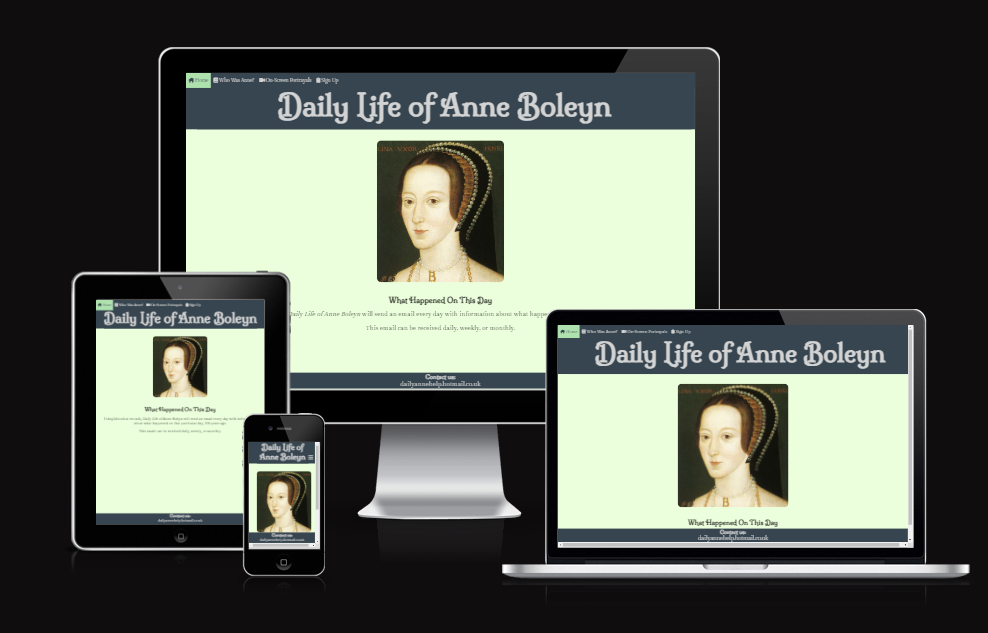

# Daily Life of Anne Boleyn
Daily Life of Anne Boleyn is a website that sends out a daily, weekly, or monthly email to the user about what happened to Anne Boleyn 500 years before. It also contains biographical information on Anne Boleyn, and a page containing all of the media appearances that include her as a character. 
The intended user base for this website is people who are interested in history, and wish to learn more about the Tudor period. There is a question on the form page about whether users would be interested in other prominent Tudors, to see if there is a market for expansion.

# Planning Stage
## User Stories
The idea came from wanting a website which would offer information about Anne Boleyn, and her impact on British History. Having all of the information in one place makes it easier to navigate, and having the information come as an email rather than a website so that the user does not need to actively check the website.

## Owner Goals
The inspiration to do this as a daily email came from [ Frankenstein Daily](https://frankensteindaily.substack.com/) and [Dracula Daily](https://draculadaily.substack.com/). However, these websites only give the daily update, and I wanted to create something which would offer more information about Anne, such as her biography and on-screen potrayals. 

## Wireframes

The first step was to create a wireframe of what I wished to achieve both desktop and mobile. The initial plan was to have the about section on the index page, and a header with an image. As the project progressed, the header became text only, and the about section became it's own individual page. The layout of the media page also changed from two columns to three on desktops.

## Design
The imagery was easier to locate, due to this being related to Anne. The background I wanted green due to the (unproved) theory that Green Sleeves was written about her. I went for a pale green to ensure that this would still be visible. The header and navigation bar is in a dark grey so as not to clash. The font for the header was selected as it is easy to read, but has a historical look to it. Similar reasons were chosen for the main body text ensuring that this was serif, but still easy to read. 

# Features
## Navigation Bar

The navigation bar is available in the same order on all pages to make for ease of navigation. On mobile it is under a burger icon so that it takes up less space and can be opened and closed as required. On larger screens it is fixed to the top to make for easy scrolling. It is the same colour as the header, except for the open page, this is to ensure ease of navigation.

## Index Page

The index page is a simple page, with an image of Anne Boleyn, and a description of what the page's intent is and why. This includes the most famous painting of Anne, to be eyecatching.
## Footer

The footer gives a simple email address to contact with further questions. This is for ease for the user.
## Who Was Anne page

The About Anne page is a brief overview of Anne's life. The first five sections are about Anne's life, with relevant images. On mobile the images are under the headers, whilst larger screens they are on the left. This was important to include as it gives users an idea about who Anne was and her importance to history.
## Children Section

The children section is part of the about page as it helps apply context to Anne's importance in history, including after her death. The information about Elizabeth also links into the question later on the form querying if information about other Tudors would be of interest as it gives an example. 
## Map

The map gives the location of where Anne is buried. 
## Media Page

The media page lists all of the actresses who have played Anne, including the name of the works and the year. This is so that if the user wishes to watch anything they have an easy place to find all of the onscreen portrayals of Anne.
## Video

The video is complete with controls so that the user can choose if they wish to interact or not. The video is of the West End/Broadway show portrayal of Anne.
## Form

The form takes the name and email address, and won't submit unless these are correctly input. It also asks how often the emails should be sent for the user's preference, as well as if they'd be interested in other Tudors, to see if expansion would be a useful feature to implant in the future.

# Testing

## Browsers
I have opened the website on Google Chrome, Microsoft Edge and Firefox, and am happy this works on all websites. I have also opened this on my mobile, and happy this runs as expected. 

## Validation
* No HTML errors found when run through [W3C Validator](https://validator.w3.org/nu/)
* No CSS errors found when run through [Jigsaw W3](https://jigsaw.w3.org/css-validator/Email.html)

## Lighthouse
I have run all pages through Lighthouse, both mobile and desktop, to ensure fully accessible. Accessibility score has come back on all pages as 100.

## Responsiveness

### Header
For the header, on mobile screens, the navigation bar is beneath a burger icon that has to be clicked on in order for the options to come up. This saves space on smaller devices. On a tablet or desktop, the navigation bar is fixed to the top of the screen as this has more space. The header text is set to be central on all screen sizes, but with different font sizes in order to fit the type of device.

### Index Page
The image on the index page is responsive to screen size. The text on larger screens also increases in size.

### Who Was Anne page
Each section is underneath a clear header for navigation. Each section contains a header, text about the subject, and a relevant image. On a mobile screen, the image appears between the header and the text, on a tablet or a desktop it appears to the left side. 

### On-Screen Portrayals
Each div contains an image of the actress, and some text. On a mobile screen this is a single column, with the picture above the text. On a tablet sized screen, these are in rows of two, and on a desktop, this is in rows of three. On each sized screen there is a hr line between each row.

## Pilot Testing
After the main pages had been created, I showed this to a relative for their opinions on if this was logical and what they would expect from a website. 
* Children page - at the time, the information about Elizabeth was on a separate page. The feedback advised that this was better suited on the Who Was Anne page as it is not a main focus for the site and also shows the longer impact Anne had on history.
* Wives page - there had originally been a page about the six wives of Henry VIII. The feedback was that this was a little redundant, especially as Catherine and Jane's significance to Anne was featured on the Who Was Anne page, and the other three had no real connection. Because of this, I removed this page, however did use the responsive coding on the media page.
* Sign Up form - on the navigation, this was the second link. It made more sense for this to be the last one, and so I moved this
After these changes were made, they agreed that the website made more sense to read
* Spacing - Some of the spacing wasn't big enough, and made for difficult reading. Because of this I added padding and margins.
* Font - in some places, such as the middle of an H, the font was too thin for this to be readable. Because of this, I increased the font weight.

## Bugs
### Footer
The footer would not remain at the bottom of the page. On the main and sign up page, it would go to the bottom of the text, and on other pages appeared about halfway down. There was also a horizontal scroll bar, despite nothing to scroll. Setting the position for the index and sign up page did make this appear nearer the bottom, however there was still some space beneath this. Eventually, setting the footer as a flexbox, I was able to get the footer to remain at the bottom. I also removed all margins to remove the space. The issue with the scrollbar was caused by the width of the header.

## Future Additions
I would like to add an example to the index page that changes to w

# Deployment
This was deployed to GitHub pages
* Clicked onto the settings tab, and then onto *Pages* under *Code and automation*
* Ensured Branch was set to *Main*, and saved
* Located under *Environments*
The deployed site can be located here: https://bryonyrblack.github.io/anne-boleyn/index.html

# Credits
## Content
* Footer pushed down, code from Love Running
* Historical Facts from Tudors by Peter Ackroyd
* Mobile Navigation bar from Love Running
* Icons in the navigation bar from Font Awesome
* Form currently sends to https://formdump.codeinstitute.net/

## Media
* All the images used are from Google Images, with license set to Creative Commons licenses
